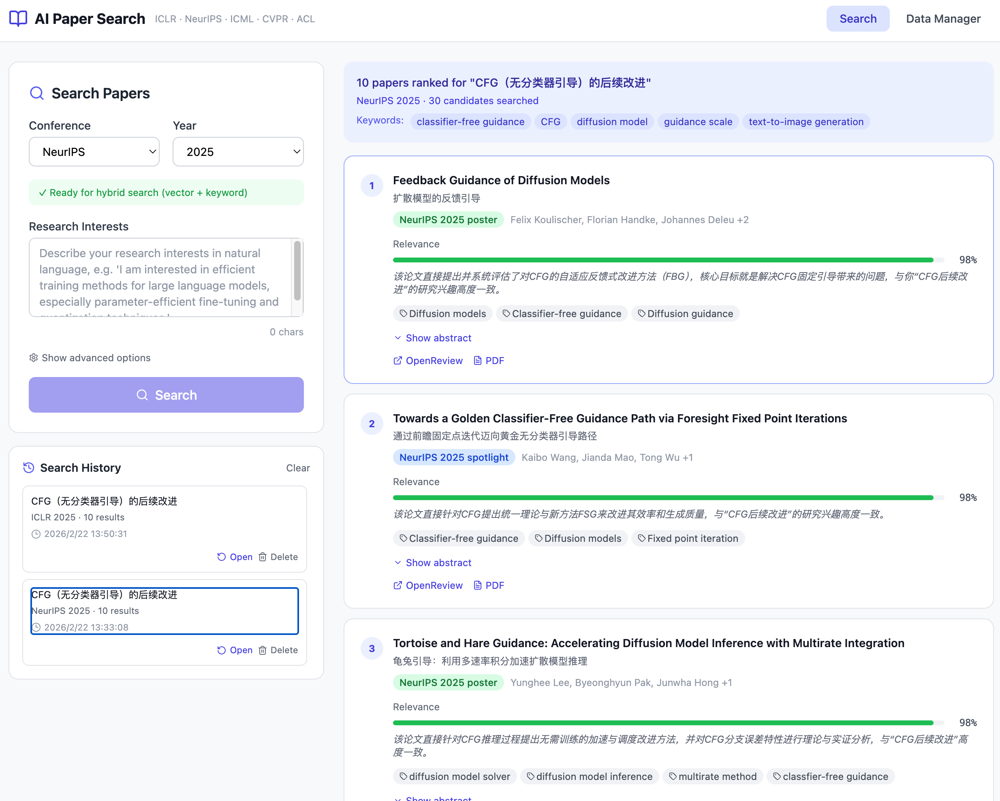

# 分享一个小工具：按研究兴趣全面搜索 AI 顶会论文

每到AI会议放榜的时候，总会想看看有没有跟自己研究方向相关的新工作。但官网的搜索实在太难用了——要么是全文关键词死匹配，要么翻页翻到手酸。GPT搜索又没办法保证检索的全面性, 已有的项目也都不太满意。

于是自己写了个小工具解决这个需求，功能不复杂，但用起来还挺顺手，分享出来。

---

## 它能做什么

输入你的研究兴趣（一段描述就行，不需要精确关键词），它会：

1. 用 LLM 提取和扩展关键词
2. 向量检索 + 关键词匹配 + RRF 融合排序
3. 可选：让 LLM 给每篇论文打相关性分并给出理由（支持中英文理由）
4. 可选：把标题和摘要翻译成中文

目前支持的会议：**ICLR、NeurIPS、ICML、CVPR、ACL**（2024 年起）。

---

## 怎么用

整体分三步，前两步对每个会议年份只需要做一次。

**第一步：抓数据**

在 Data Manager 里选会议 + 年份，点 Fetch，从 OpenReview 把论文数据拉下来存到本地。

**第二步：建索引**

点 Build Index，用 embedding 模型给所有论文的标题 + 摘要 + 关键词建向量索引，持久化到本地。推荐使用硅基流动的 embedding api，四五千条论文数据embedding费用大概4毛钱，只需要embedding一次就行。

**第三步：搜索**

在 Search 页面贴上你的研究兴趣描述，点搜索，等结果出来就行。搜索历史会自动保存在本地，方便回看。推荐启用 LLM 相关性评分功能，能显著提升检索质量。

---

## GitHub

项目链接：https://github.com/shilong20/openreview_search

如果觉得不错，欢迎 star